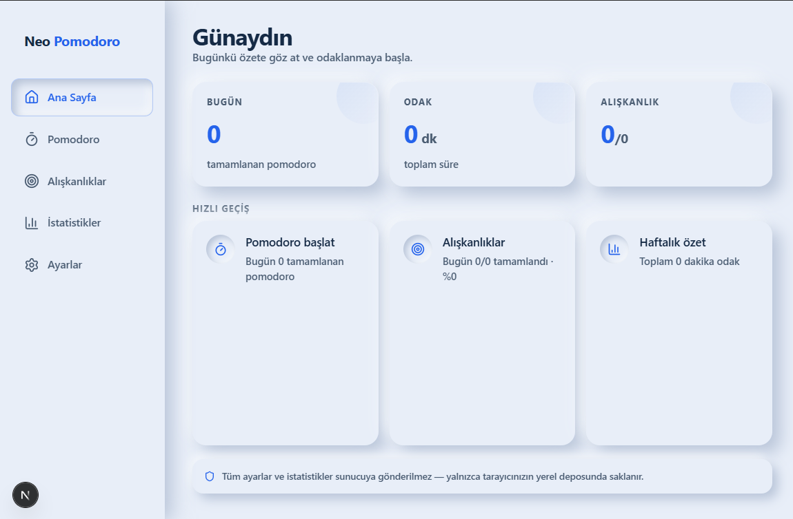

# Easy Productivity

> **Odaklan. Alışkanlık kazan. İlerlemeni gör.**



npm workspaces monorepo: **web (Next.js)**, **mobil (Expo / React Native)** ve **masaüstü (Electron)**. Ortak iş mantığı `packages/shared` altında.

Tauri yok — bu makinede Rust/`cargo` yoktu; masaüstü kabuğu Electron. Tauri istersen sonra `apps/desktop` yerine eklenebilir.

---

## Bu proje nedir?

Easy Productivity, dağınık dikkat çağında **sade bir üretkenlik alanı** sunar. Odak seanslarını zamanla, görevlerine pomodoro ata, günlük rutinlerini işaretle ve ilerlemeni tek ekranda takip et.

Neomorphism (soft UI) tasarım diliyle yumuşak, göz yormayan bir arayüz; mavi-beyaz tema ile net ve sakin bir deneyim.

| | |
|---|---|
| ⏱ **Derin odak** | Klasik pomodoro döngüsü — odak, kısa mola, uzun mola |
| ✓ **Net plan** | Görevlere tahmini pomodoro hedefi |
| 🎯 **Küçük adımlar** | Günlük alışkanlıklar, seri takibi, heatmap |
| 🔒 **Tamamen yerel** | Hesap yok · bulut yok · reklam yok |

---

## Hangi teknoloji?

| Katman | Teknoloji |
|--------|-----------|
| Web / PWA | Next.js 16 + React 19, `apps/web` |
| Mobil | Expo 53 / React Native, `apps/mobile` |
| Masaüstü | Electron, `apps/desktop` (web’i `localhost:3000` ile açar) |
| Domain | TypeScript, `packages/shared` |

Web bileşenleri DOM’a bağlı; RN onları reuse etmez. Timer, alışkanlık ve tarih matematiği paylaşılır.

---

## Proje yapısı

```
easy-pomodoro/
├── apps/web/         Next.js 16, React 19, Tailwind 4
├── apps/mobile/      Expo / React Native
├── apps/desktop/     Electron kabuğu
├── packages/shared/  Platformdan bağımsız TypeScript mantık
└── package.json      npm workspaces
```

---

## Gereksinimler

Node.js 20+, npm 10+. Mobil için Expo Go (veya Android Studio / Xcode).

---

## Kurulum

```powershell
git clone https://github.com/KULLANICI/easy-pomodoro.git
cd easy-pomodoro
npm install
```

### Web

```powershell
npm run dev
```

Tarayıcıda **http://localhost:3000**.

### Web (Docker)

Production imajı yalnızca Next.js web uygulamasını çalıştırır:

```powershell
docker compose up --build
```

**http://localhost:4523** (compose `4523:3000`). Durdurmak: `docker compose down`.

Canlı alan adı için `.env` içinde `NEXT_PUBLIC_SITE_URL=https://ornek.com` — Open Graph, sitemap ve JSON-LD bunu kullanır. Docker imajı bu değeri **build** anında gömer (`docker compose build --build-arg NEXT_PUBLIC_SITE_URL=...`).

### Mobil

```powershell
npm run mobile
```

QR kodu Expo Go ile okut. Android emülatör: `npm run android`.

### Masaüstü (Electron)

Web sunucusu yoksa script onu da açar:

```powershell
npm run desktop
```

Production:

```powershell
npm run build
npm start
```

> Service worker yalnızca web production’da etkinleşir. Electron / statik export’ta kapalıdır.

---

## Özellikler

| Özellik | Web | Mobil |
|---------|:---:|:-----:|
| Pomodoro zamanlayıcı (3 faz) | ✅ | ✅ |
| Arka plan dayanıklı sayaç (`endTime`) | ✅ | ✅ |
| Görev CRUD | ✅ | ✅ |
| Alışkanlık takibi | ✅ | ✅ |
| İstatistikler | ✅ | ✅ |
| 6 UI stili + karanlık mod | ✅ | palet |
| TR / EN | ✅ | ✅ |
| Ses + bildirim | ✅ | — |
| PWA / offline cache | ✅ | — |
| Veri dışa/içe aktar + sıfırla | ✅ | — |

---

## Tasarım sistemi

Sabit açık mod varsayılan · neomorphism · mavi-beyaz palet.

| Token | Değer | Kullanım |
|-------|-------|----------|
| Arka plan | `#e8eef8` | Ana canvas |
| Vurgu | `#2563eb` | Butonlar, aktif durumlar |
| Metin | `#1e3a5f` | Başlıklar, gövde |
| Kısa mola | `#14b8a6` | Faz rengi |
| Uzun mola | `#6366f1` | Faz rengi |

Web CSS: `apps/web/src/app/globals.css`, stil token’ları `apps/web/src/app/ui-styles.css`.

### UI stili / tema geçişleri (web)

- Tema = `<html>` üzerindeki CSS değişkenleri + `data-ui-style` / `data-theme`
  öznitelikleri (`apps/web/src/lib/theme.ts`).
- Son uygulanan tema `localStorage`’a önbelleklenir; `<head>`’deki küçük boot
  script (`lib/theme-boot.ts`) onu **ilk boyamadan önce** uygular — sayfa
  yenilenince varsayılan neo tema bir anlığına görünmez.
- Stil / mod / palet değişimi `runThemeSwitch()` ile tek adımda yapılır:
  geçiş süresince öğe animasyonları dondurulur (gradyan, iç gölge ve
  `backdrop-filter` ara değerlenemediği için yarım kalmış yüzeyler oluşuyordu)
  ve tarayıcı destekliyorsa View Transitions ile tıklanan noktadan dairesel bir
  geçiş yapılır. `prefers-reduced-motion` açıkken anında değişir.

Mobil (Flutter) karşılığı için `mobile/README.md` → “Yüzey stilleri”.

---

## Script referansı

| Komut | Açıklama |
|-------|----------|
| `npm run dev` | Web geliştirme sunucusu |
| `npm run build` | Web production build |
| `npm run start` | Web production sunucusu |
| `npm run lint` | ESLint (web) |
| `npm run mobile` | Expo başlat |
| `npm run android` | Expo Android |
| `npm run desktop` | Electron + gerekirse Next.js |
| `npm run docker:up` | Web’i Docker Compose ile ayağa kaldır |
| `npm run docker:down` | Compose yığınını durdur |

---

## SEO

`NEXT_PUBLIC_SITE_URL` kanonik adres (sonda `/` yok). Yoksa `http://localhost:3000`.

| Yol | Ne işe yarar |
|-----|----------------|
| `/` | `title`, description, canonical, Open Graph, Twitter card, JSON-LD |
| `/opengraph-image` | 1200×630 paylaşım görseli |
| `/twitter-image` | Twitter kart görseli |
| `/robots.txt` | Tarama kuralları + sitemap |
| `/sitemap.xml` | Ana URL |

---

## PWA olarak yükleme

1. Production build al: `npm run build && npm start`
2. Chrome’da siteyi aç
3. Menü → **Ana ekrana ekle** / **Yükle**

iOS Safari: Paylaş → **Ana Ekrana Ekle**

---

## Geliştirici notları

1. İş mantığını `packages/shared` altına koy
2. Web UI `apps/web/src`, mobil UI `apps/mobile`
3. Neomorphism sınıflarını web’de kullan (`neo-surface`, `neo-inset` vb.)

---

## Gizlilik

Easy Productivity tamamen yerel çalışır:

- Kullanıcı hesabı veya kayıt yoktur
- Veriler sunucuya gönderilmez
- Analitik veya izleme SDK’sı kullanılmaz
- Üçüncü taraf API çağrısı yoktur

Web: `localStorage`. Mobil: AsyncStorage. Tarayıcı / uygulama verilerini temizlediğinde kayıtlar silinir.
